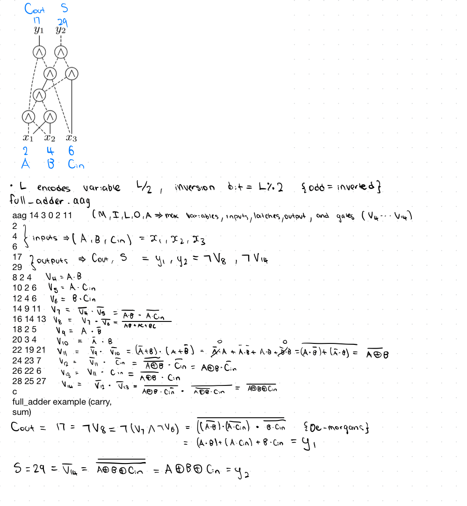

# AAG format examples

## And example

`examples/and2.aag`

```and2.aag
aag 3 2 0 1 1
2 = A (input 1)
4 = B (input 2)
6 = Y (output)
6 2 4 (Y = A & B)
```

The first line is the header which follows MILOA format.

```text
M=3: highest variable index is 3

I=2: two primary inputs

L=0: no latches

O=1: one primary output

A=1: one AND gate
```

The order of this encoding is node output, input1, input2. Hence Y = A & B. The node literal representations are displayed below


## Full adder example

`examples/full_adder.aag`


### Full Adder Truth Table

| A | B | Cin | Sum | Cout |
|---|---|-----|-----|------|
| 0 | 0 |  0  |  0  |  0   |
| 0 | 0 |  1  |  1  |  0   |
| 0 | 1 |  0  |  1  |  0   |
| 0 | 1 |  1  |  0  |  1   |
| 1 | 0 |  0  |  1  |  0   |
| 1 | 0 |  1  |  0  |  1   |
| 1 | 1 |  0  |  0  |  1   |
| 1 | 1 |  1  |  1  |  1   |

This truth table is equivalent to the full adder boolean logic


This can be represented in AIGER format as follows. 

```full_adder.aag
aag 14 3 0 2 11
2
4
6
17
29
8 2 4
10 2 6
12 4 6
14 9 11
16 14 13
18 2 5
20 3 4
22 19 21
24 23 7
26 22 6
28 25 27
c
full_adder example (carry, sum)
```

We can see that the aig respresented above is functionally equivalent to the boolean logic. Each aig node is enumerated with the corresponding literals and node logic values in the example below



