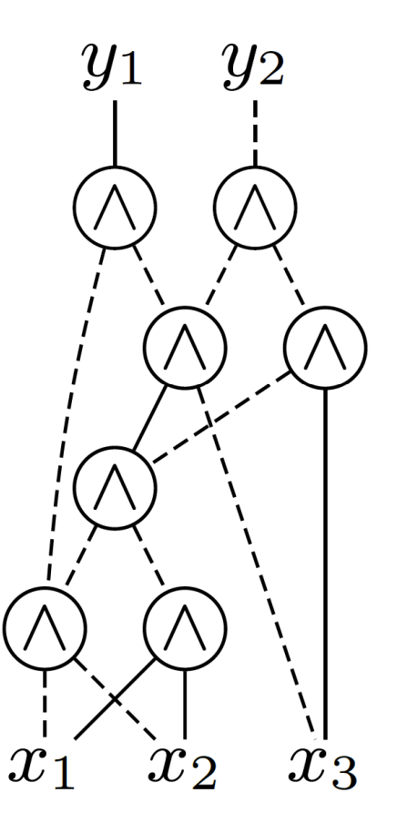
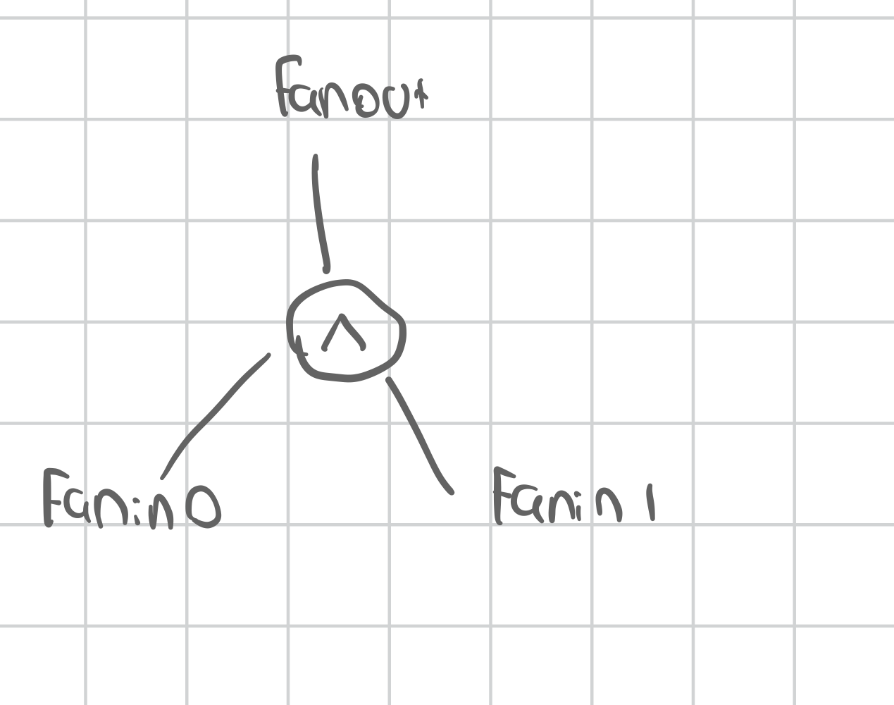

# Notes

## And Inverter Graph (AIG)

An AIG is a directed acyclic graph that represents Boolean functions using only AND nodes and optional inversion on edges. Each node has two inputs and one output and inputs may be inverted. By composing these nodes, any Boolean function can be built

## AIG structure

- Outputs at the top of the aig tree (y1, y2)
- Inputs at the bottom of the aig tree (x1, x2, x3)
- Variables (and constant 𝑥0 = 0) as roots at the bottom and
function outputs as terminals on top
- Inner nodes compute the AND function of their two predecessors
and have arbitrarily many successors (fan-outs)
- Edges are either inverting (dashed) or non-inverting (straight) when represented visually



## Show truth table

We can output a truth table of the aig by firstly enumerating the inputs and secondly for every input which forms the row of the truth table we can run the input into the evaluate_aig function to generate the truth table output which we append to each row.

This is handled in `generate_truth_table`

## Enumerating inputs

We can generate ordered truth table from inputs by counting from 0 to 2^n - 1 and enumerating the binary.

e.g for 2 inputs, we have 2^2 = 4 rows, and the truth table is:
This logic (i >> bit) & 1u extracts the bit at each position for each row using a bit mask

```plaintext
i = 0 (binary 00):
  bit 1: (0 >> 1) & 1 = 0
  bit 0: (0 >> 0) & 1 = 0
  row pushed: {0, 0}

i = 1 (binary 01):
  bit 1: (1 >> 1) & 1 = 0
  bit 0: (1 >> 0) & 1 = 1
  row pushed: {0, 1}

i = 2 (binary 10):
  bit 1: (2 >> 1) & 1 = 1
  bit 0: (2 >> 0) & 1 = 0
  row pushed: {1, 0}

i = 3 (binary 11):
  bit 1: (3 >> 1) & 1 = 1
  bit 0: (3 >> 0) & 1 = 1
```

## Show stats

- Counts (inputs, outputs, ANDs):
 the type of node is stored in the AigNode object by design

- Depth: We do a DFS from each output literal, memoizing depths by canonical even literal to reduce repeated calculations. We keep track of the max depth found to give the longest path

- Max fan‑out: By iterating through every AND node we increment the fan‑out of its two fan‑ins, and also increment for each outputs driving literal (output labelled nodes).
We take the max of all of the fan-out computations by iterating over the hashmap of each nodes individual fan-outs.

## Fan-out and Fan-ins



### Fan-in of a node

The number of inputs driving that node

### Fan-out of a node

The number of gate input pins that the node drives

A high fanout implies one driver is feeding many loads which can translate to larger capacative loads and slower switching on chips

### Full Adder example

- In our full adder AIG the net for literal 2 (x2) feeds four downstream inputs (including the y2 output) so max fan‑out = 4.
- Also every AND node in an AIG is strictly 2 input, so the max fan‑in would be 2 for
