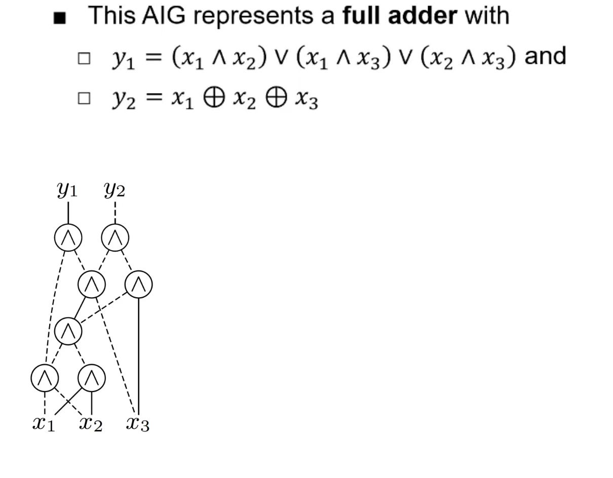

# Notes

## And inverter graph

An And-Inverter Graph (AIG) is a directed acyclic graph that represents Boolean functions using only AND nodes and optional inversion on edges. Each node has two inputs and one output and inputs may be inverted. By composing these nodes, any Boolean function can be built

## AIGER ASCII Format (.aag)

An AIG node is represented by a literal, which is an integer that can be either even or odd. It encodes both the node number and whether the node is inverted or not

```text
aag M I L O A
< I input literals >
< L latch lines >
< O output literals >
< A AND-gate lines: one per gate >
```

- M: highest variable index (max node id)

- I: number of primary inputs

- L: number of latches (usually 0)

- O: number of primary outputs

- A: number of AND gates

## Literals

A literal is a 32-bit integer encoding both node index and inversion

- Literal = node number * 2 + inversion bit = ID
- Even Literals: positive non inverted node (inversion bit = 0)
- Odd Literals: inverted node (inversion_bit = 1)

Suppose L is a literal, then:
Node number = L // 2 (same as L >> 1)
Inversion bit = L % 2

Example:
Literal 6: Node 3, normal
Literal 7: Node 3, inverted

### Canonical Literal 

- A canonical literal is the even version of a literal, which is used to represent the without the inversion bit.
- This allows us to group nodes that are logically equivalent. It can be thought of as a group id for the node.
- We use when  we look up or store groups in a map e.g: unordered_map<Lit,AigNode>

`L & ~1u (removes the inversion bit)`

```plaintext
lit=2  binary=010  => canonical=2  bin=010
lit=3  binary=011  => canonical=2  bin=010

lit=4  binary=100  => canonical=4  bin=100
lit=5  binary=101  => canonical=4  bin=100
```

### Canonical literal vs node id (number)

The canonical literal gives us logically equivalent nodes for the given aag format.  

### Constant Literals

Literal 0 → constant FALSE
Literal 1 → constant TRUE

## Mapping literals to node Ids

we use this to get contiguous node numbering so we can work with vectors. This gives the numeric index of the node

\

This allows us to group up literals that belong to the same node ID

<https://fmv.jku.at/aiger/FORMAT.aiger>

aag file format is a text format for AIGER files.

This is human readable and can be used to create AIGER files. it has .aag extension

## And example

```and2.aag
aag 3 2 0 1 1
2 = A (input 1)
4 = B (input 2)
6 = Y (output)
6 2 4 (Y = A & B)
```

The first line is the header which follows MILOA format.

```text
M=3: highest variable index is 3

I=2: two primary inputs

L=0: no latches

O=1: one primary output

A=1: one AND gate

For the line 6 2 4

Node n;

n.id = 6;

n.fanin0 = 2;

n.fanin1 = 4;
```

This encodes the AND gate operation, where 6 is the node id, and 2 and 4 are the input nodes. Because they are even they are non inverted and 2 gives node number 2 / 2 = 1 (A) and 4 gives node number 4 / 2 = 2 (B).

The order of this encoding is node output, input1, input2. Hence Y = A & B,


### Full adder example

A more complex aig representation is a full adder. The logic for a full adder is demonstrated in the truth table below:

<!--  -->



### Full Adder Truth Table

| A | B | Cin | Sum | Cout |
|---|---|-----|-----|------|
| 0 | 0 |  0  |  0  |  0   |
| 0 | 0 |  1  |  1  |  0   |
| 0 | 1 |  0  |  1  |  0   |
| 0 | 1 |  1  |  0  |  1   |
| 1 | 0 |  0  |  1  |  0   |
| 1 | 0 |  1  |  0  |  1   |
| 1 | 1 |  0  |  0  |  1   |
| 1 | 1 |  1  |  1  |  1   |

This can be represented in AIGER format as follows

```full_adder.aag
aag 14 3 0 2 11
2
4
6
17
29
8 2 4
10 2 6
12 4 6
14 9 11
16 14 13
18 2 5
20 3 4
22 19 21
24 23 7
26 22 6
28 25 27
c
full_adder example (carry, sum)
```

The image below explains the AAG representation of the full adder, and how each line in the aag file encodes a node to represent the full adder logic.


## enumerate_inputs example

We can generate ordered truth table from inputs by counting from 0 to 2^n - 1 and enumerating the binary.

e.g for 2 inputs, we have 2^2 = 4 rows, and the truth table is:
This logic (i >> bit) & 1u extracts the bit at each position for each row

```plaintext
i = 0 (binary 00):
  bit 1: (0 >> 1) & 1 = 0
  bit 0: (0 >> 0) & 1 = 0
  row pushed: {0, 0}

i = 1 (binary 01):
  bit 1: (1 >> 1) & 1 = 0
  bit 0: (1 >> 0) & 1 = 1
  row pushed: {0, 1}

i = 2 (binary 10):
  bit 1: (2 >> 1) & 1 = 1
  bit 0: (2 >> 0) & 1 = 0
  row pushed: {1, 0}

i = 3 (binary 11):
  bit 1: (3 >> 1) & 1 = 1
  bit 0: (3 >> 0) & 1 = 1
  ```

  ### evaluate_aig example


## Show stats

- This shows the number of inputs, outputs, and and gates (the type of node is stored in the aig node object)
- We also show the depth of the aig by computing a dfs upwards from outputs to inputs and updating the length of the max path found
- We compute the fanouts counts by incrementing each of the two fanins of the node and ignore the constants. We also increment each outputs driving literal. We find the max fanout by iterating over the fanout hash map linking the canonical (even) literal and taking the max value

## Fanout and Fanins

Fanin of a node: the number of inputs driving that node
Fanout of a node: the number of gate input pins that the node drives

A high fanout implies one driver is feeding many loads which can translate to larger capacative loads and slower switching on chips


For example the full adder has a maximum fanout of 4. Node 2 (x1) has 4 inputs pins driving it